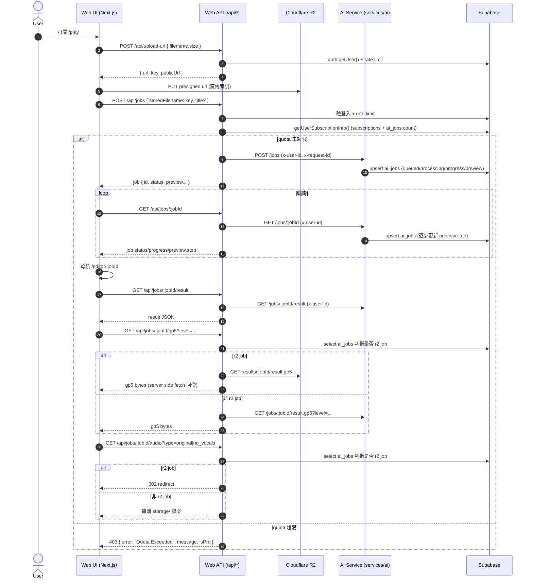
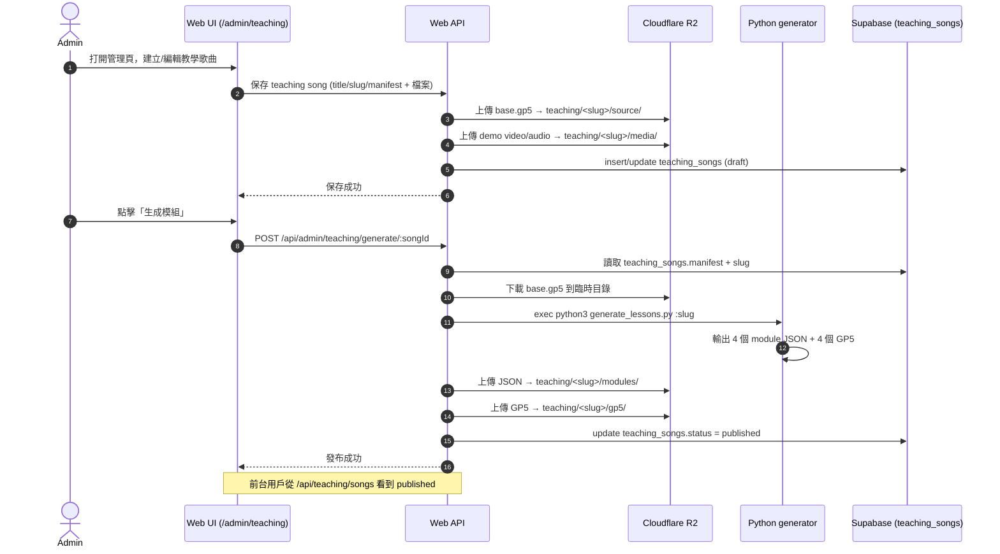
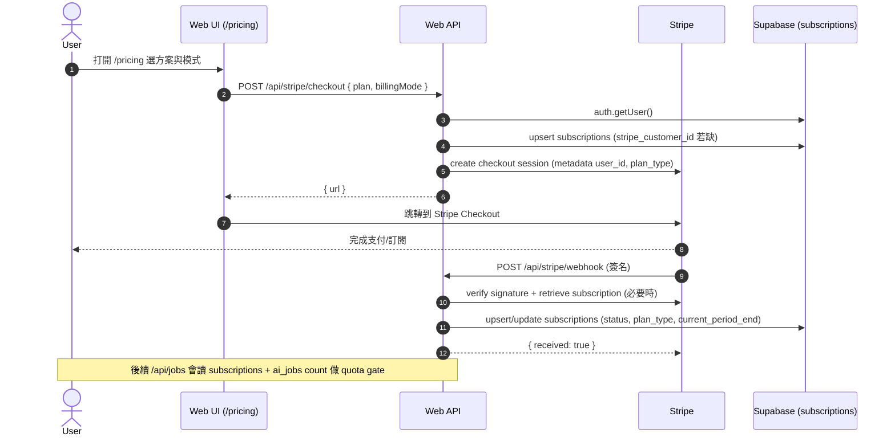

# Biubiutab Web 版完整文檔

> 版本：`v1.3`｜最後更新：2026-05-22｜維護分支：`apps/web`

本文檔是 Web 版的**唯一權威文檔**，涵蓋產品需求、技術架構、端到端流程、API 契約、資料庫 Schema、環境配置與部署策略。後續任何 Web 功能變更應同步更新此文件。

---

## 版本記錄

| 版本 | 日期 | 變更摘要 |
|------|------|---------|
| v1.3 | 2026-05-22 | Desktop 離線/未登入模式：移除 Play/Practice 強制登入跳轉，teaching_songs 公開讀取 RLS policy |
| v1.2 | 2026-05-22 | 新增下載頁、官網下載 CTA、定價頁桌面版引導、electron-builder 打包配置 |
| v1.1 | 2026-05-21 | 新增 `/api/me/subscription`、Dashboard 會員狀態、Admin Setup API、Admin RPC fallback、教學 R2 分發方案、Desktop API 清單 |
| v1.0 | 2026-05-21 | 初始版本，合併 WEB_TECH_DOC + WEB_PRD + WEB_DESKTOP_REFERENCE 為統一文檔 |

---

## 目錄

- [1. 產品概述](#1-產品概述)
- [2. 角色與分級策略](#2-角色與分級策略)
- [3. 核心功能模組](#3-核心功能模組)
  - [3.1 註冊/登入與會話](#31-註冊登入與會話)
  - [3.2 AI 制譜（Play / Jobs）](#32-ai-制譜play--jobs)
  - [3.3 Editor 與跟彈練習](#33-editor-與跟彈練習)
  - [3.4 Dashboard（我的曲譜）](#34-dashboard我的曲譜)
  - [3.5 教學內容庫（Learn）](#35-教學內容庫learn)
  - [3.6 Admin 教學內容生成與發布](#36-admin-教學內容生成與發布)
  - [3.7 付費（Stripe）](#37-付費stripe)
  - [3.8 訂閱狀態查詢](#38-訂閱狀態查詢)
- [4. 技術架構](#4-技術架構)
- [5. 鑑權與權限](#5-鑑權與權限)
- [6. 資料庫 Schema](#6-資料庫-schema)
- [7. Cloudflare R2 分發模型](#7-cloudflare-r2-分發模型)
- [8. 完整 API 清單](#8-完整-api-清單)
- [9. 端到端時序圖](#9-端到端時序圖)
- [10. 環境變數](#10-環境變數)
- [11. 代碼結構](#11-代碼結構)
- [12. Desktop 端對齊參考](#12-desktop-端對齊參考)
- [13. 已知風險與缺口](#13-已知風險與缺口)

---

## 1. 產品概述

### 1.1 產品願景

讓使用者把一段音訊快速轉成可播放、可跟彈、可練習的吉他譜（GP5/譜面播放）。同時提供教學內容庫，把歌曲拆成 Warmup / Basic / Advanced / Solo 的分段練習，並在 Pro 方案中解鎖更完整的高階模組與 Demo video。

### 1.2 Web 端定位

Web 是整個產品的 BFF（Backend-for-Frontend）：同時提供 UI（Next.js App Router）與 API（Route Handlers）。AI/DSP 實際運算在 `services/ai`（Python FastAPI）完成，Web 端負責：

- 鑑權（Supabase auth）
- 訂閱/配額 gate（Free/Pro）
- Upload/R2 交互（presigned URL）
- 對 AI service 的 proxy（降低 CORS、統一錯誤、附加 request-id）
- Stripe 支付流程與 webhook 同步

### 1.3 主要模組

| 模組 | 說明 |
|------|------|
| Auth | Supabase session + middleware 路由保護 |
| 生成 | Play → Upload → Create Job → Poll → Editor |
| 跟彈練習 | PracticeMode + AlphaTab 播放/控制 |
| 教學 | Learn：Warmup/Basic/Advanced/Solo；內容由 admin pipeline 發布 |
| 付費 | Stripe checkout + webhook 同步 subscriptions |
| 內容分發 | Cloudflare R2（音訊、結果、教學素材） |

---

## 2. 角色與分級策略

### 2.1 角色

| 角色 | 說明 |
|------|------|
| 一般使用者 | 上傳音訊生成吉他譜、練習教學模組 |
| 管理員（Admin） | 建立/管理教學歌曲、觸發內容生成、發布至前台 |

### 2.2 訂閱方案（Free vs Pro）

| 權益 | Free | Pro |
|------|------|-----|
| AI 制譜次數/月 | 3 次 | 100 次 |
| 教學模組 | Warmup + Basic | 全部（含 Advanced + Solo） |
| Demo Video | 不可見 | 可見 |
| GP5 下載 | 無 | 可下載 |

**配額規則**：以本月（當月第一天至今）`ai_jobs` 數量作為 `usedQuota`。超額時 `POST /api/jobs` 回 403 並給出清晰提示。

**付費方案**：

| 週期 | 月付 | 季付 | 年付 |
|------|------|------|------|
| 價格 | ￥29/月 | ￥69/季 | ￥199/年 |
| 付費模式 | 自動續訂（信用卡）/ 單次充值（含支付寶） | 同左 | 同左 |

---

## 3. 核心功能模組

### 3.1 註冊/登入與會話

**功能**：使用者可註冊/登入並保持會話。未登入不可使用消耗算力與敏感資源的能力（生成、上傳、Dashboard、Admin）。

**Middleware 路由保護**（[middleware.ts](file:///Users/unknownseed/Developer/biubiutab/apps/web/src/middleware.ts#L70-L98)）：

```
受保護前綴: /dashboard, /play, /editor, /update-password, /admin,
            /api/jobs, /api/upload-url, /api/uploads, /api/admin
```

**行為**：
- 未登入訪問受保護 API → 401 JSON
- 未登入訪問受保護頁面 → redirect `/login`
- 已登入訪問 `/login` → redirect `/`

### 3.2 AI 制譜（Play / Jobs）

**入口**：`/play` → 掛載 `UploadClient`（[upload-client.tsx](file:///Users/unknownseed/Developer/biubiutab/apps/web/src/components/upload-client.tsx)）

**流程**：
1. 呼叫 `POST /api/upload-url` 取得 R2 presigned URL
2. 前端直傳 R2（顯示進度條）
3. 呼叫 `POST /api/jobs` 建立 job（帶 `storedFilename` 或 `url`）
4. 輪詢 `GET /api/jobs/:jobId` 顯示 pipeline 進度
5. 成功後導向 `/editor/:jobId`

**建立 Job 的 Server Gate**（[route.ts](file:///Users/unknownseed/Developer/biubiutab/apps/web/src/app/api/jobs/route.ts)）：
- 必須登入
- Rate limit（user + ip token bucket）：user: 3/min, ip: 15/min
- Quota gate：`usedQuota >= totalQuota` → 403
- storedFilename 安全校驗：只含 `[a-zA-Z0-9._\-/]`，且前綴必須是 `uploads/<userId>/`
- 支援兩種 input：`url`（http/https）或 `storedFilename`

### 3.3 Editor 與跟彈練習

**路由**：`/editor/[jobId]`（[editor-client.tsx](file:///Users/unknownseed/Developer/biubiutab/apps/web/src/components/editor-client.tsx)）

**核心組件**：`PracticeMode`（[PracticeMode.tsx](file:///Users/unknownseed/Developer/biubiutab/apps/web/src/components/PracticeMode.tsx)）
- AlphaTab 驅動譜面渲染與播放
- 播放控制（播放/暫停/速度）
- 音源切換（原聲/去人聲）：透過 `GET /api/jobs/:jobId/audio?type=original|no_vocals`

### 3.4 Dashboard（我的曲譜）

**路由**：`/dashboard`（[page.tsx](file:///Users/unknownseed/Developer/biubiutab/apps/web/src/app/dashboard/page.tsx)）

**功能**：
- 顯示歷史完成的 jobs 列表（只顯示 `status = 'succeeded'`）
- 支援刪除
- 顯示會員狀態區塊：
  - `isPro / planType / currentPeriodEnd`
  - `usedQuota / totalQuota` + 進度條
  - Free 用戶有「升级 Pro」按鈕（→ `/pricing`）

**數據來源**：server-side 呼叫 `getUserSubscriptionInfo(user.id)`，讀取 `subscriptions` + count 本月 `ai_jobs`。

### 3.5 教學內容庫（Learn）

**路由結構**：

| 路由 | 說明 | Free | Pro |
|------|------|------|-----|
| `/learn` | 教學曲目列表（只顯示 published） | 可見 | 可見 |
| `/learn/[slug]/warmup` | 預習模組 | 可練，無 demo video | 可練 + demo video |
| `/learn/[slug]/basic` | 基礎跟彈 | 可練，無 demo video | 可練 + demo video |
| `/learn/[slug]/advanced` | 進階技巧 | 鎖定，引導 `/pricing` | 可練 + demo video |
| `/learn/[slug]/solo` | Solo 即興 | 鎖定，引導 `/pricing` | 可練 |

**練習區塊（PracticeBlock）**：每個 PracticeBlock 可載入 GP5、設置 tempo、loop 範圍、顯示 tips、可選 Demo video（Pro 才顯示）。

**內容格式（module JSON）**：
- 包含 `gp5_url`、`tempo`/`bpm`、`loop_bars`、`demo_video`、`tips` 等欄位
- gp5_url 格式：`/api/teaching/gp5/<slug>/<filename>`
- media URL 格式：`/api/teaching/media/<slug>/<filename>`

### 3.6 Admin 教學內容生成與發布

**路由**：

| 路由 | 說明 | 鑑權 |
|------|------|------|
| `/admin/teaching` | 教學管理列表頁 | 登入 + `isAdminEmail` |
| `/admin/teaching/[songId]` | 編輯/新增教學歌曲 | 登入 + `isAdminEmail` |
| `/api/admin/teaching/songs` | CRUD API | 登入 + `isAdminEmail` + `user_id` 權限 |
| `/api/admin/teaching/generate/<songId>` | Web 端觸發生成 | 登入 + `isAdminEmail` |
| `/api/desktop/admin/teaching/generate/<songId>` | Desktop 端觸發生成 | Bearer token + `is_admin()` RPC（fallback email 白名單） |
| `/api/admin/setup` | 一鍵初始化 admin（建立 admin_users 表 + 插入當前用戶） | 登入 + `isAdminEmail` |

**Admin 權限模型**（雙重 fallback）：

1. `is_admin()` RPC：優先使用 DB 層 `admin_users` 表（[/admin-rpc.ts](file:///Users/unknownseed/Developer/biubiutab/apps/web/src/lib/admin-rpc.ts)）
2. `ADMIN_EMAILS` 白名單：RPC 不存在時 fallback
3. `isAdminEmail()`：僅 email 白名單（[/admin.ts](file:///Users/unknownseed/Developer/biubiutab/apps/web/src/lib/admin.ts)）

**生成流程**：
1. Admin 保存素材（title/slug/manifest + base.gp5 + demo video/audio）
2. 素材上傳到 R2：`teaching/<slug>/source/base.gp5`、`teaching/<slug>/media/...`
3. 點擊「生成模組」→ API 從 R2 下載 base.gp5 到臨時目錄
4. 設定 `BIUBIU_TEACHING_SONGS_DIR` / `BIUBIU_TEACHING_PUBLIC_DIR` 環境變數
5. 執行 `python3 services/ai/generate_lessons.py <slug>`
6. 收集輸出的 4 個 JSON + 4 個 GP5，上傳到 R2
7. 更新 `teaching_songs.status = 'published'`
8. 清理臨時目錄

### 3.7 付費（Stripe）

**價格頁**：`/pricing`（[page.tsx](file:///Users/unknownseed/Developer/biubiutab/apps/web/src/app/pricing/page.tsx)）

**Checkout 流程**（[route.ts](file:///Users/unknownseed/Developer/biubiutab/apps/web/src/app/api/stripe/checkout/route.ts)）：
1. 驗證登入
2. 若無 `stripe_customer_id` → 建立 Stripe customer + upsert `subscriptions`
3. 建立 checkout session（metadata 帶 `user_id`、`plan_type`）
4. 返回 `{ url }`，前端跳轉到 Stripe

**Webhook 事件處理**（[route.ts](file:///Users/unknownseed/Developer/biubiutab/apps/web/src/app/api/stripe/webhook/route.ts)）：
- `customer.subscription.created|updated`：更新 `stripe_subscription_id/status/plan_type/current_period_end`
- `customer.subscription.deleted`：標記 `status = canceled`
- `checkout.session.completed`：
  - `mode = payment`（單次充值）：延長 `current_period_end` 31/90/365 天
  - `mode = subscription`：retrieve subscription 取得 `current_period_end` 後 upsert active

### 3.8 訂閱狀態查詢

**Endpoint**：`GET /api/me/subscription`（[route.ts](file:///Users/unknownseed/Developer/biubiutab/apps/web/src/app/api/me/subscription/route.ts)）

**鑑權**：

| 客戶端 | 方式 |
|--------|------|
| Web（同源） | Cookie session |
| Desktop（跨域） | `Authorization: Bearer <supabase_access_token>` |

**回傳**：

```json
{
  "userId": "uuid",
  "isPro": true,
  "planType": "monthly",
  "status": "active",
  "currentPeriodEnd": "2026-06-20T00:00:00.000Z",
  "usedQuota": 12,
  "totalQuota": 100
}
```

**內部依賴**：`getUserSubscriptionInfoForClient(supabase, userId)`（[subscriptions.ts](file:///Users/unknownseed/Developer/biubiutab/apps/web/src/lib/subscriptions.ts)）

---

## 4. 技術架構

```
┌──────────────────────────────────────────────┐
│                   Browser                    │
│  Next.js App Router (SSR + Client)           │
│  AlphaTab 譜面渲染 + 播放                     │
└──────────────┬───────────────────────────────┘
               │ fetch /api/*
┌──────────────▼───────────────────────────────┐
│               Web Server (Next.js)            │
│  Route Handlers:                             │
│    /api/jobs/*  /api/upload-url              │
│    /api/teaching/*  /api/stripe/*            │
│    /api/me/subscription                       │
│  Lib: ai.ts, subscriptions.ts, r2.ts, etc.   │
└──┬──────────────────┬────────────────────┬───┘
   │ Supabase JS      │ aiFetch()          │ S3 SDK
   ▼                  ▼                    ▼
┌──────────┐   ┌──────────────┐   ┌────────────────┐
│ Supabase │   │ AI Service   │   │ Cloudflare R2  │
│ auth     │   │ (Python      │   │ (Object Store) │
│ DB       │   │  FastAPI)    │   │                │
│ RLS      │   │ :8001        │   │                │
└──────────┘   └──────────────┘   └────────────────┘
```

**核心 lib**：

| 檔案 | 職責 |
|------|------|
| [ai.ts](file:///Users/unknownseed/Developer/biubiutab/apps/web/src/lib/ai.ts) | AI service proxy（timeout、retry、x-request-id） |
| [subscriptions.ts](file:///Users/unknownseed/Developer/biubiutab/apps/web/src/lib/subscriptions.ts) | 訂閱狀態與 quota 計算 |
| [r2.ts](file:///Users/unknownseed/Developer/biubiutab/apps/web/src/lib/r2.ts) | R2 S3 client、put/get/public URL |
| [teaching-r2.ts](file:///Users/unknownseed/Developer/biubiutab/apps/web/src/lib/teaching-r2.ts) | 教學 R2 key 計算與上傳 |
| [rate-limit.ts](file:///Users/unknownseed/Developer/biubiutab/apps/web/src/lib/rate-limit.ts) | Token bucket rate limiter |
| [admin.ts](file:///Users/unknownseed/Developer/biubiutab/apps/web/src/lib/admin.ts) | Email 白名單 admin 判斷 |
| [admin-rpc.ts](file:///Users/unknownseed/Developer/biubiutab/apps/web/src/lib/admin-rpc.ts) | `is_admin()` RPC + fallback email 的雙重鑑權 |
| [stripe.ts](file:///Users/unknownseed/Developer/biubiutab/apps/web/src/lib/stripe.ts) | Stripe client singleton |

---

## 5. 鑑權與權限

### 5.1 Supabase Session（SSR + middleware）

- Middleware 建立 SSR supabase client 並執行 `auth.getUser()`（防止 token 偽造）。
- 受保護路由前綴在 middleware 集中管理。

### 5.2 Admin 權限雙重模型

| 層級 | 機制 | 檔案 |
|------|------|------|
| DB 層 | `admin_users` 表 + `is_admin()` RPC | [supabase_teaching_admin_users.sql](file:///Users/unknownseed/Developer/biubiutab/supabase_teaching_admin_users.sql) |
| 應用層 | `ADMIN_EMAILS` 環境變數白名單 | [admin.ts](file:///Users/unknownseed/Developer/biubiutab/apps/web/src/lib/admin.ts) |
| 統一入口 | `isAdmin()` 優先 RPC，失敗 fallback email | [admin-rpc.ts](file:///Users/unknownseed/Developer/biubiutab/apps/web/src/lib/admin-rpc.ts) |

### 5.3 Cookie Session vs Bearer Token

| 客戶端 | 鑑權方式 | 適用 API |
|--------|---------|----------|
| Web 瀏覽器 | Cookie session（middleware 自動處理） | 所有 `/api/*` |
| Desktop Electron | `Authorization: Bearer <token>` | `/api/me/subscription`、`/api/desktop/admin/teaching/*` |
| Stripe Webhook | `SUPABASE_SERVICE_ROLE_KEY` | `/api/stripe/webhook` |

---

## 6. 資料庫 Schema

### 6.1 ai_jobs（AI 生成任務）

**主要欄位**（以 [main.py](file:///Users/unknownseed/Developer/biubiutab/services/ai/main.py#L308-L323) 的 upsert payload 為準）：

| 欄位 | 類型 | 說明 |
|------|------|------|
| `id` | text | job id（`[a-zA-Z0-9_-]+`） |
| `user_id` | uuid | Supabase user id（RLS key） |
| `status` | text | queued / processing / succeeded / failed |
| `progress` | number | 進度（0~1 或 0~100） |
| `message` | text | 使用者可見狀態訊息 |
| `error` | text | 失敗原因 |
| `audio_path` | text | R2: `uploads/<userId>/...`，URL: 原始 URL |
| `title` | text | 曲目標題 |
| `result` | json | 生成結果 JSON |
| `preview` | json | 前端顯示 step 的來源（可能含 `storage_provider`） |
| `created_at` | timestamptz | Dashboard 排序依賴 |

**RLS**：[supabase_ai_jobs_rls.sql](file:///Users/unknownseed/Developer/biubiutab/supabase_ai_jobs_rls.sql)
- authenticated 只能 CRUD 自己的 `user_id`
- service_role 全權

**Quota 計數**：以 `created_at >= 本月第一天 AND user_id = currentUser` 的筆數為準。

### 6.2 subscriptions（訂閱狀態）

**DDL**：[supabase_subscriptions.sql](file:///Users/unknownseed/Developer/biubiutab/supabase_subscriptions.sql#L1-L12)

| 欄位 | 類型 | 說明 |
|------|------|------|
| `id` | uuid | PK |
| `user_id` | uuid | FK → auth.users, UNIQUE |
| `stripe_customer_id` | text | Stripe 客戶 ID |
| `stripe_subscription_id` | text | Stripe 訂閱 ID, UNIQUE |
| `plan_type` | text | free / monthly / quarterly / yearly |
| `status` | text | inactive / active / canceled |
| `current_period_end` | timestamptz | 有效期截止 |
| `created_at` | timestamptz | |
| `updated_at` | timestamptz | |

**RLS**：使用者只可 select 自己；service_role 全權。

### 6.3 teaching_songs（教學曲目目錄）

| 欄位 | 類型 | 說明 |
|------|------|------|
| `id` | uuid | PK |
| `user_id` | uuid | ownership（admin 用途） |
| `slug` | text | URL key，亦用於定位 R2 key |
| `title` | text | 曲目標題（非空） |
| `artist` | text | 藝術家 |
| `status` | text | draft / published |
| `manifest` | json | 完整教學配置（含 structure, chords, challenges 等） |
| `created_at` | timestamptz | |
| `updated_at` | timestamptz | |

**RLS Policy**：[supabase_teaching_admin_users.sql](file:///Users/unknownseed/Developer/biubiutab/supabase_teaching_admin_users.sql#L21-L35)
- Admins（`is_admin() = true`）可管理所有 teaching_songs
- 任何人（anon + authenticated）可讀取 `status = 'published'` 的歌曲

### 6.4 admin_users（管理員表）

**DDL**：[supabase_teaching_admin_users.sql](file:///Users/unknownseed/Developer/biubiutab/supabase_teaching_admin_users.sql#L1-L4)

| 欄位 | 類型 |
|------|------|
| `user_id` | uuid PK → auth.users |
| `created_at` | timestamptz |

搭配 `is_admin()` RPC function 供 DB 層 admin 權限判斷。

---

## 7. Cloudflare R2 分發模型

### 7.1 使用者上傳（音訊）

**流程**：`POST /api/upload-url` → 瀏覽器 PUT presigned URL → R2

**Key 規則**（[upload-url/route.ts](file:///Users/unknownseed/Developer/biubiutab/apps/web/src/app/api/upload-url/route.ts)）：

```
uploads/<userId>/<timestamp>-<rand>.<ext>
```

### 7.2 AI 生成產物

**AI Service 上傳**（[main.py](file:///Users/unknownseed/Developer/biubiutab/services/ai/main.py#L1012-L1061)）：

```
results/<jobId>/result.gp5
results/<jobId>/result_l1.gp5
results/<jobId>/result_l2.gp5
results/<jobId>/result_l3.gp5
results/<jobId>/output.json
stems/<jobId>/no_vocals.mp3
```

### 7.3 教學內容

**Key 規則**（[teaching-r2.ts](file:///Users/unknownseed/Developer/biubiutab/apps/web/src/lib/teaching-r2.ts)）：

| 內容 | R2 Key |
|------|--------|
| 來源 GP5 | `teaching/<slug>/source/base.gp5` |
| 教學 modules JSON | `teaching/<slug>/modules/{warmup\|basic\|advanced\|solo}.json` |
| 教學 GP5 片段 | `teaching/<slug>/gp5/{warmup\|basic\|advanced\|solo}.gp5` |
| Demo 音/影片 | `teaching/<slug>/media/demo_video.<ext>` / `demo_audio.<ext>` |
| Manifest 快照 | `teaching/<slug>/manifest.json` |

### 7.4 CORS 策略

| 資源類型 | 分發方式 | CORS 處理 |
|----------|---------|----------|
| 音訊（jobs） | 302 redirect 到 `CLOUDFLARE_PUBLIC_DOMAIN` | 直接播放 |
| GP5（jobs/teaching） | Server-side fetch R2 → 回傳 bytes | Web 代理繞過 CORS |
| Teaching Module JSON | Server-side fetch R2 → 回傳 JSON | Web 代理 |
| Teaching Demo Media | 302 redirect 到 `CLOUDFLARE_PUBLIC_DOMAIN` | 直接播放 |

---

## 8. 完整 API 清單

### 8.1 生成（Jobs）

| 方法 | 路徑 | 說明 | 鑑權 |
|------|------|------|------|
| POST | `/api/upload-url` | 取得 R2 presigned PUT URL | Cookie |
| POST | `/api/jobs` | 建立 AI 生成任務 | Cookie |
| GET | `/api/jobs/:jobId` | 輪詢 job 狀態 | Cookie |
| GET | `/api/jobs/:jobId/result` | 取得生成結果 JSON | Cookie |
| GET | `/api/jobs/:jobId/gp5?level=1-4` | 下載 GP5 bytes | Cookie |
| GET | `/api/jobs/:jobId/audio?type=original\|no_vocals` | 取得音訊 | Cookie |

### 8.2 教學（Teaching）- 前台

| 方法 | 路徑 | 說明 | 鑑權 |
|------|------|------|------|
| GET | `/api/teaching/songs` | 教學曲目列表（只回 published） | 無 |
| GET | `/api/teaching/songs/:slug/:module` | 讀取 module JSON | 無 |
| GET | `/api/teaching/gp5/:slug/:filename` | 下載教學 GP5 bytes | 無 |
| GET | `/api/teaching/media/:slug/:filename` | 取得教學演示媒體 | 無 |

### 8.3 教學（Teaching）- Admin（Web）

| 方法 | 路徑 | 說明 | 鑑權 |
|------|------|------|------|
| GET | `/api/admin/teaching/songs` | 列出 teaching songs | Cookie + admin |
| POST | `/api/admin/teaching/songs` | 建立 teaching song | Cookie + admin |
| GET | `/api/admin/teaching/songs/:songId` | 取得單一 teaching song | Cookie + admin |
| PUT | `/api/admin/teaching/songs/:songId` | 更新 teaching song | Cookie + admin |
| DELETE | `/api/admin/teaching/songs/:songId` | 刪除 teaching song | Cookie + admin |
| POST | `/api/admin/teaching/generate/:songId` | 觸發生成教學模組 | Cookie + admin |

### 8.4 教學（Teaching）- Admin（Desktop）

| 方法 | 路徑 | 說明 | 鑑權 |
|------|------|------|------|
| POST | `/api/desktop/admin/teaching/songs/:songId/save` | 保存教學歌曲（含檔案上傳） | Bearer + admin |
| POST | `/api/desktop/admin/teaching/generate/:songId` | 觸發生成教學模組 | Bearer + admin |

### 8.5 付費（Stripe）

| 方法 | 路徑 | 說明 | 鑑權 |
|------|------|------|------|
| POST | `/api/stripe/checkout` | 建立 Stripe checkout session | Cookie |
| POST | `/api/stripe/webhook` | Stripe webhook 接收器 | Stripe 簽名 |

### 8.6 用戶狀態

| 方法 | 路徑 | 說明 | 鑑權 |
|------|------|------|------|
| GET | `/api/me/subscription` | 查詢訂閱狀態與本月配額 | Cookie / Bearer |

### 8.7 Admin 管理

| 方法 | 路徑 | 說明 | 鑑權 |
|------|------|------|------|
| POST | `/api/admin/setup` | 一鍵初始化 admin（建表 + 插入） | Cookie + admin email |
| GET | `/api/admin/health` | 環境變數健康檢查 | Cookie + admin email |

---

## 9. 端到端時序圖

### 9.1 AI 制譜（上傳 → 建立 Job → 輪詢 → Editor）



### 9.2 教學內容（Admin 保存素材 → 生成 → 發布）



### 9.3 Stripe（Pricing → Checkout → Webhook → 生效）



---

## 10. 環境變數

### 10.1 Supabase

| 變數 | 用途 |
|------|------|
| `NEXT_PUBLIC_SUPABASE_URL` | Middleware + client 初始化 |
| `NEXT_PUBLIC_SUPABASE_ANON_KEY` | Middleware + client 初始化 |
| `SUPABASE_SERVICE_ROLE_KEY` | Stripe webhook 寫 subscriptions |

### 10.2 AI Service

| 變數 | 預設值 | 用途 |
|------|--------|------|
| `AI_BASE_URL` | `http://127.0.0.1:8001` | AI service 位址 |
| `AI_SERVICE_TOKEN` | - | `x-ai-token` 內部認證 |
| `AI_FETCH_TIMEOUT_MS` | 15000 | Fetch timeout（Vercel 下上限 9s） |

### 10.3 Cloudflare R2

| 變數 | 預設值 | 用途 |
|------|--------|------|
| `CLOUDFLARE_ACCOUNT_ID` | - | R2 帳戶 ID |
| `CLOUDFLARE_ACCESS_KEY_ID` | - | R2 API token |
| `CLOUDFLARE_SECRET_ACCESS_KEY` | - | R2 API secret |
| `CLOUDFLARE_BUCKET_NAME` | `biubiutab-uploads` | R2 bucket 名稱 |
| `CLOUDFLARE_PUBLIC_DOMAIN` | - | 公開域名（用於 redirect/gp5 proxy） |

### 10.4 Stripe

| 變數 | 用途 |
|------|------|
| `STRIPE_SECRET_KEY` | Stripe client 初始化 |
| `STRIPE_WEBHOOK_SECRET` | Webhook 簽名驗證 |
| `STRIPE_PRICE_SUB_{MONTHLY\|QUARTERLY\|YEARLY}` | Subscription price IDs |
| `STRIPE_PRICE_ONETIME_{MONTHLY\|QUARTERLY\|YEARLY}` | One-time price IDs |
| `NEXT_PUBLIC_SITE_URL` | Checkout 成功/取消跳轉 URL |

### 10.5 其他

| 變數 | 用途 |
|------|------|
| `ADMIN_EMAILS` | 管理員 email 白名單（逗號分隔） |
| `JOB_CREATE_PER_MIN_USER` | user rate limit（預設 3） |
| `JOB_CREATE_PER_MIN_IP` | IP rate limit（預設 15） |
| `UPLOAD_URL_PER_MIN_USER` | upload URL rate limit（預設 10） |
| `UPLOAD_URL_PER_MIN_IP` | upload URL rate limit（預設 30） |

---

## 11. 代碼結構

```
apps/web/
├── src/
│   ├── app/
│   │   ├── api/
│   │   │   ├── admin/
│   │   │   │   ├── health/route.ts          # 環境變數健康檢查
│   │   │   │   ├── setup/route.ts           # Admin 一鍵初始化
│   │   │   │   └── teaching/
│   │   │   │       ├── songs/route.ts       # Teaching CRUD
│   │   │   │       ├── songs/[songId]/route.ts
│   │   │   │       └── generate/[songId]/route.ts  # Web 生成
│   │   │   ├── desktop/admin/teaching/
│   │   │   │   ├── songs/[songId]/save/route.ts    # Desktop 保存
│   │   │   │   └── generate/[songId]/route.ts      # Desktop 生成
│   │   │   ├── jobs/
│   │   │   │   ├── route.ts                 # 建立 job + rate/quota gate
│   │   │   │   └── [jobId]/
│   │   │   │       ├── route.ts             # 輪詢 job
│   │   │   │       ├── result/route.ts
│   │   │   │       ├── gp5/route.ts         # GP5 bytes (R2←→AI)
│   │   │   │       └── audio/route.ts       # 音訊 (R2 redirect)
│   │   │   ├── me/subscription/route.ts     # 訂閱狀態查詢
│   │   │   ├── stripe/
│   │   │   │   ├── checkout/route.ts        # Stripe checkout
│   │   │   │   └── webhook/route.ts         # Stripe webhook
│   │   │   ├── teaching/
│   │   │   │   ├── songs/route.ts           # 前台教學列表
│   │   │   │   ├── songs/[slug]/[module]/route.ts  # Module JSON
│   │   │   │   ├── gp5/[slug]/[filename]/route.ts  # 教學 GP5 proxy
│   │   │   │   └── media/[slug]/[filename]/route.ts # 教學媒體 proxy
│   │   │   └── upload-url/route.ts          # R2 presigned URL
│   │   ├── admin/teaching/                  # Admin UI 頁面
│   │   ├── learn/                           # 前台 Learn UI
│   │   ├── dashboard/                       # Dashboard
│   │   ├── editor/                          # Editor
│   │   ├── play/                            # Play (上傳入口)
│   │   └── pricing/                         # 價格頁
│   ├── components/
│   │   ├── upload-client.tsx                # 上傳 + 輪詢 + 建立 job
│   │   ├── editor-client.tsx                # Editor 容器
│   │   ├── PracticeMode.tsx                 # AlphaTab 播放核心
│   │   └── PracticeBlock.tsx (learn)        # Learn 練習區塊
│   └── lib/
│       ├── ai.ts                            # AI service proxy
│       ├── subscriptions.ts                 # 訂閱 + quota 計算
│       ├── r2.ts                            # R2 S3 client
│       ├── teaching-r2.ts                   # 教學 R2 key 工具
│       ├── rate-limit.ts                    # Token bucket
│       ├── admin.ts                         # Email 白名單
│       ├── admin-rpc.ts                     # is_admin() RPC + fallback
│       ├── stripe.ts                        # Stripe client
│       ├── env.ts                           # requireEnv
│       ├── paths.ts                         # repoRoot
│       └── supabase/server.ts              # SSR supabase client
├── songs/<slug>/                            # Teaching 輸出（R2 啟用時為空）
├── public/gp5/<slug>/                       # GP5 檔案（R2 啟用時為空）
├── public/media/<slug>/                     # Media 檔案（R2 啟用時為空）
└── package.json
```

---

## 12. Desktop 端對齊參考

### 12.1 整體策略

- Desktop 優先把 Web 當成「權限與資源的統一入口」：
  - 訂閱/配額 gate 在 Web
  - R2 CORS 處理在 Web（gp5 route 由 server-side fetch 回 bytes）
  - 教學 modules 的發布狀態與讀取在 Web
- Desktop 應避免直接呼叫 Python AI service（會繞過 quota/rate limit）

### 12.2 Desktop 需要對齊的 Web API（最小集合）

| 功能 | API | 鑑權方式 |
|------|-----|---------|
| 上傳 | `POST /api/upload-url` | Cookie / Bearer |
| 建立 job | `POST /api/jobs` | Cookie / Bearer |
| 輪詢 job | `GET /api/jobs/<jobId>` | Cookie / Bearer |
| GP5 | `GET /api/jobs/<jobId>/gp5?level=...` | Cookie / Bearer |
| 音訊 | `GET /api/jobs/<jobId>/audio?type=...` | Cookie / Bearer |
| 訂閱狀態 | `GET /api/me/subscription` | Bearer |
| 教學列表 | `GET /api/teaching/songs` | 無 |
| 教學 module | `GET /api/teaching/songs/<slug>/<module>` | 無 |
| 教學 GP5 | `GET /api/teaching/gp5/<slug>/<filename>` | 無 |
| 教學媒體 | `GET /api/teaching/media/<slug>/<filename>` | 無 |
| 教學保存 | `POST /api/desktop/admin/teaching/songs/:songId/save` | Bearer + admin |
| 教學生成 | `POST /api/desktop/admin/teaching/generate/:songId` | Bearer + admin |
| Stripe checkout | `POST /api/stripe/checkout` | Cookie / Bearer |

### 12.3 Desktop 環境配置

在 `apps/desktop/.env`（已 gitignored）：

```
WEB_BASE_URL=http://localhost:3000
```

### 12.4 Desktop Admin 初始化

Desktop admin 依賴 `is_admin()` RPC。若 RPC 不存在：
1. 在瀏覽器訪問 `http://localhost:3000/api/admin/setup`
2. 按回傳指引在 Supabase SQL Editor 執行 SQL
3. 或直接執行 `supabase_teaching_admin_users.sql`

---

## 13. Desktop 打包與分發

### 13.1 打包流程

Desktop 使用 `electron-builder` 打包，配置在 [apps/desktop/package.json](file:///Users/unknownseed/Developer/biubiutab/apps/desktop/package.json) 的 `build` 區塊。

```bash
# 在 apps/desktop 目錄下執行

# 打包 macOS dmg（arm64 + x64）
npm run dist:mac

# 打包 Windows exe（x64）
npm run dist:win

# 列出所有平台
npm run dist
```

### 13.2 打包前必要步驟

1. `apps/desktop-ui` 先構建：`npm run build`（產生 `desktop-ui/dist/`）
2. `apps/desktop` 構建主進程：`npm run build`（或 `npm run dist` 會自動串接）
3. 確認 `.env` 中 `WEB_BASE_URL` 指向正式部署的 Web API domain（非 localhost）

### 13.3 產物

| 平台 | 格式 | 檔案路徑 |
|------|------|---------|
| macOS (arm64) | DMG | `apps/desktop/release/BiuBiuTab-0.2.0-arm64.dmg` |
| macOS (x64) | DMG | `apps/desktop/release/BiuBiuTab-0.2.0-x64.dmg` |
| Windows (x64) | NSIS Installer | `apps/desktop/release/BiuBiuTab-0.2.0-x64.exe` |

### 13.4 分發策略

- **R2 Public Bucket**：將安裝檔上傳到 R2 public domain，下載頁直接連結（CORS 已覆蓋）
- **GitHub Releases**：每次發佈 tag 時 CI 可自動上傳到 GitHub Releases
- **下載頁**：[`/download`](file:///Users/unknownseed/Developer/biubiutab/apps/web/src/app/download/page.tsx) 連結指向 `/downloads/BiuBiuTab-latest-*.dmg|exe`

### 13.5 官網下載 CTA 位置

| 位置 | 說明 |
|------|------|
| 首頁 Hero | Hero CTA 區域，和「BiuBiu弹唱」並排，連結指向 `/download` |
| 首頁頁尾 | 「准备开始」區塊，含「下载桌面版」+「升级 Pro」雙按鈕 |
| 定價頁底部 | 「还有桌面版？」引導區塊，含「免费下载桌面版」按鈕 |

### 13.6 更新 Desktop 端 `WEB_BASE_URL`

打包前，`apps/desktop/.env` 中的 `WEB_BASE_URL` 需改為正式部署域名（如 `https://your-domain.com`）。

---

## 14. 已知風險與缺口

| 風險 | 說明 | 狀態 |
|------|------|------|
| Admin 權限混用 | Web admin API 用 email 白名單，Desktop API 用了 RPC+fallback。部分路由仍有 `user_id` 限制 | 部分修復 |
| Desktop local IPC 未被 UI 使用 | main.ts 有 8 個教學本地 IPC handler，但 AdminTeachingEditPage 完全使用 cloud API | 設計選擇 |
| 教學內容部署節奏 | R2 模式解決了即時發布，但需確保 R2 env 配置 | ✅ 已解決 |
| `repoRoot()` 路徑假設 | 假設 `process.cwd() === apps/web`，非本地部署可能出錯 | 待觀察 |
| is_admin RPC 依賴 | Desktop admin API 依賴 RPC 存在，不存在的話 fallback 到 email 白名單 | ✅ 已修復（v1.1） |
| Desktop `.env` 需手動建立 | gitignored，需在 setup 文檔中說明 | 文件已涵蓋 |

---

> **維護約定**：任何 Web 端的 API 新增、schema 變更、流程調整，都必須同步更新此文件的對應章節並遞增版本號。
