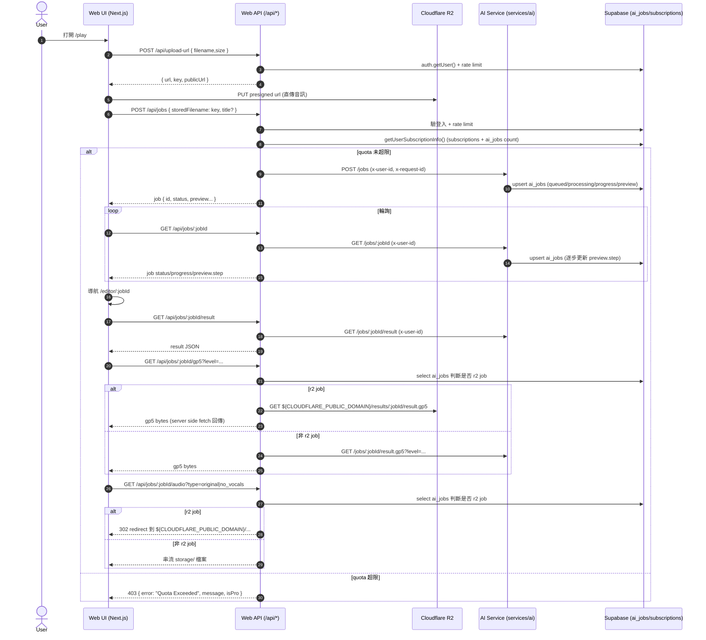
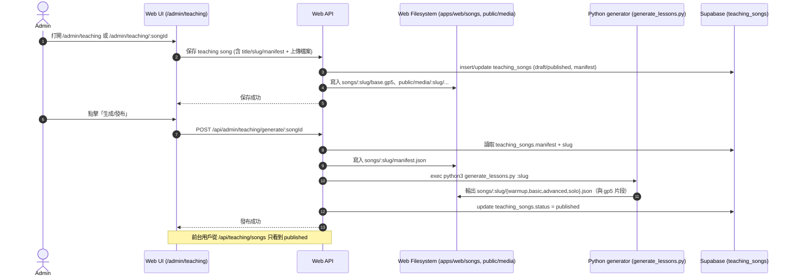
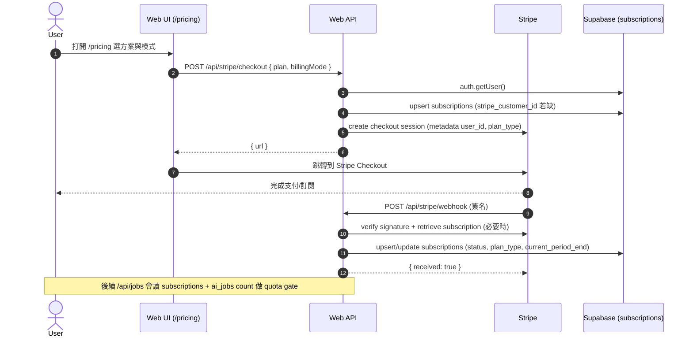

# Web 技術文檔（Biubiutab Web）

本文檔以 `apps/web` 為準，覆蓋：AI 制譜生成（jobs）、播放與跟彈練習（practice）、教學內容（teaching）、Stripe 訂閱/充值（subscription），以及 Cloudflare R2 分發模型。供後續 Desktop 端對齊與復用。

## 1. 範圍與目標

### 1.1 Web 端的定位

- Web 是整個產品的 BFF（Backend-for-Frontend）：同時提供 UI（Next.js App Router）與 API（Route Handlers）。
- AI/DSP 實際運算在 `services/ai`（Python FastAPI）完成，Web 端負責：
  - 鑑權（Supabase）
  - 訂閱/配額 gate（Free/Pro）
  - Upload/R2 交互（presigned URL）
  - 對 AI service 的 proxy（降低 CORS、統一錯誤、附加 request-id）

### 1.2 主要模組

- Auth：Supabase session + middleware 路由保護
- 生成（Play → Upload → Create Job → Poll → Editor）
- 跟彈練習（PracticeMode，AlphaTab 播放/控制）
- 教學（Learn：Warmup/Basic/Advanced/Solo；內容由 admin pipeline 發布）
- 付費（Stripe checkout + webhook 同步 subscriptions）
- 內容分發（Cloudflare R2；教學 modules 在 Web 專案 `songs/` 以檔案形式隨部署分發）

## 2. 代碼結構

- UI（頁面）：`apps/web/src/app/**/page.tsx`
- API（Route Handlers）：`apps/web/src/app/api/**/route.ts`
- 共用 lib：`apps/web/src/lib/**`
- 教學輸出檔案（隨 Web 部署）：`apps/web/songs/<slug>/*.json|gp5`
- AI Service：`services/ai/main.py`（jobs API 與 pipeline）

## 3. 鑑權與權限

### 3.1 Supabase session（SSR + middleware）

- Middleware 會建立 SSR supabase client 並執行 `auth.getUser()`，避免 token 造假。
- 需要登入的路由前綴（包含 API）在 middleware 內集中管理：[/middleware.ts](file:///Users/unknownseed/Developer/biubiutab/apps/web/src/middleware.ts#L70-L98)
- 行為：
  - 未登入訪問受保護 API：回 401 JSON
  - 未登入訪問受保護頁面：重定向 `/login`
  - 已登入訪問 `/login`：重定向 `/`

### 3.2 Admin 權限（目前 Web 版）

- Web admin 的判斷是「email 白名單」：[/admin.ts](file:///Users/unknownseed/Developer/biubiutab/apps/web/src/lib/admin.ts#L1-L9)
- 教學管理 API 目前限制：
  - 必須登入
  - `isAdminEmail(user.email)` 必須為 true
  - 部分 query 仍 `.eq('user_id', user.id)`（只看自己的教學歌單），見：[/api/admin/teaching/songs/route.ts](file:///Users/unknownseed/Developer/biubiutab/apps/web/src/app/api/admin/teaching/songs/route.ts#L19-L27)

## 4. 資料與存儲

### 4.1 Supabase 表（Web 端使用點）

- `ai_jobs`
  - 用途：記錄每次 AI 生成任務、用於 quota 計數、也用於判斷該 job 是否走 R2 分發（storage_provider / preview.storage_provider / audio_path）。
  - quota 計數：[/subscriptions.ts](file:///Users/unknownseed/Developer/biubiutab/apps/web/src/lib/subscriptions.ts#L36-L52)
  - job 取音訊/GP5 會查此表：[/audio route.ts](file:///Users/unknownseed/Developer/biubiutab/apps/web/src/app/api/jobs/%5BjobId%5D/audio/route.ts#L16-L48), [/gp5 route.ts](file:///Users/unknownseed/Developer/biubiutab/apps/web/src/app/api/jobs/%5BjobId%5D/gp5/route.ts#L11-L48)
- `subscriptions`
  - 用途：保存 stripe customer/subscription、plan_type、狀態與有效期，用於 gate 與配額計算。
  - 寫入來源：Stripe webhook（service role）：[/webhook route.ts](file:///Users/unknownseed/Developer/biubiutab/apps/web/src/app/api/stripe/webhook/route.ts#L6-L12)
  - 讀取來源：[/subscriptions.ts](file:///Users/unknownseed/Developer/biubiutab/apps/web/src/lib/subscriptions.ts#L22-L35)
- `teaching_songs`
  - 用途：教學內容「目錄/發布狀態/manifest」，實際課程 JSON 檔案在 `apps/web/songs/<slug>/`。
  - 前台列表：[/api/teaching/songs/route.ts](file:///Users/unknownseed/Developer/biubiutab/apps/web/src/app/api/teaching/songs/route.ts#L4-L18)
  - 前台 module JSON：[/api/teaching/songs/[slug]/[module]/route.ts](file:///Users/unknownseed/Developer/biubiutab/apps/web/src/app/api/teaching/songs/%5Bslug%5D/%5Bmodule%5D/route.ts#L15-L42)

### 4.2 Cloudflare R2（音訊/結果的分發）

- Web 端採用 R2 presigned URL 讓瀏覽器直傳（降低 Web server 壓力）：
  - `POST /api/upload-url` 回 `{ url, key, publicUrl }`：[/upload-url/route.ts](file:///Users/unknownseed/Developer/biubiutab/apps/web/src/app/api/upload-url/route.ts#L8-L74)
  - `key` 形如 `uploads/<userId>/<random>.mp3`，後續 jobs 以此作為 `audio_path`
- 取 GP5：
  - 若該 job 判定為 R2，Web server 會以 server side `fetch(r2Url)` 代理下載並回傳 bytes，以繞過瀏覽器對 `.r2.dev` 的 CORS 限制：[/gp5 route.ts](file:///Users/unknownseed/Developer/biubiutab/apps/web/src/app/api/jobs/%5BjobId%5D/gp5/route.ts#L23-L48)
  - 非 R2 走 AI service fallback：同檔案 L50-L69
- 取音訊：
  - R2 job 直接 `Response.redirect()` 到 `CLOUDFLARE_PUBLIC_DOMAIN/<path>`：[/audio route.ts](file:///Users/unknownseed/Developer/biubiutab/apps/web/src/app/api/jobs/%5BjobId%5D/audio/route.ts#L29-L47)
  - 非 R2 fallback 到 repo `storage/` 讀檔串流（兼容舊資料）：同檔案 L50-L85

### 4.3 教學內容的分發（Cloudflare R2）

- 教學內容的「本體」存放在 Cloudflare R2（而非隨 Web 部署的檔案），key 規則：
  - `teaching/<slug>/modules/<module>.json`
  - `teaching/<slug>/gp5/<module>.gp5`
  - `teaching/<slug>/media/<filename>`（demo video/audio）
  - `teaching/<slug>/source/base.gp5`（生成用來源）
- module JSON 讀取：`GET /api/teaching/songs/<slug>/<module>`（會先驗證 published，再從 R2 取 JSON；本地磁碟僅作為 dev fallback）：[/route.ts](file:///Users/unknownseed/Developer/biubiutab/apps/web/src/app/api/teaching/songs/%5Bslug%5D/%5Bmodule%5D/route.ts)
- GP5 讀取：`GET /api/teaching/gp5/<slug>/<filename>`（server-side 讀 R2 回 bytes，用於繞過瀏覽器對 R2 domain 的 CORS）：[/route.ts](file:///Users/unknownseed/Developer/biubiutab/apps/web/src/app/api/teaching/gp5/%5Bslug%5D/%5Bfilename%5D/route.ts)
- Media 讀取：`GET /api/teaching/media/<slug>/<filename>`（在有 public domain 時直接 redirect 到 R2 public URL）：[/route.ts](file:///Users/unknownseed/Developer/biubiutab/apps/web/src/app/api/teaching/media/%5Bslug%5D/%5Bfilename%5D/route.ts)

## 5. 生成（Jobs）端到端流程

### 5.1 前端（/play → upload → create job → poll）

- 入口：`/play` 掛載 `UploadClient`：[/play/page.tsx](file:///Users/unknownseed/Developer/biubiutab/apps/web/src/app/play/page.tsx#L1-L43)
- UploadClient 負責：
  - 呼叫 `POST /api/upload-url` 取得 presigned URL（R2）
  - 直傳 R2（顯示進度）
  - 呼叫 `POST /api/jobs` 建立 job
  - 輪詢 `GET /api/jobs/:id` 顯示 pipeline 進度，成功後導向 `/editor/:id`
  - 實作：[/upload-client.tsx](file:///Users/unknownseed/Developer/biubiutab/apps/web/src/components/upload-client.tsx#L1-L479)

### 5.2 建立 Job 的 server gate（rate limit + quota）

- `POST /api/jobs`：
  - 必須登入：[/api/jobs/route.ts](file:///Users/unknownseed/Developer/biubiutab/apps/web/src/app/api/jobs/route.ts#L20-L27)
  - 速率限制（user + ip token bucket）：同檔案 L28-L35，實作：[/rate-limit.ts](file:///Users/unknownseed/Developer/biubiutab/apps/web/src/lib/rate-limit.ts#L1-L28)
  - 配額 gate：
    - 計算 `usedQuota`（當月 ai_jobs 數量）
    - `totalQuota`：Free 3 / Pro 100
    - 超額回 403（含 isPro 與文案）：[/api/jobs/route.ts](file:///Users/unknownseed/Developer/biubiutab/apps/web/src/app/api/jobs/route.ts#L37-L51)
  - 支持兩種 input：
    - `url`（必須 http/https）
    - `storedFilename`（必須以 `uploads/<userId>/` 開頭，並通過安全字元檢查）：同檔案 L60-L73
  - 轉呼叫 AI service：`aiFetch("/jobs", { headers: { "x-user-id": user.id }})`：同檔案 L76-L89

### 5.3 Job 查詢與結果下載

- `GET /api/jobs/:jobId`：proxy to AI service（供輪詢）
- `GET /api/jobs/:jobId/result`：結果 JSON
- `GET /api/jobs/:jobId/gp5?level=...`：GP5 bytes（R2 優先）
- `GET /api/jobs/:jobId/audio?type=original|no_vocals`：音訊（R2 redirect / fallback 串流）

## 6. Editor 與跟彈（Practice）

### 6.1 Editor 頁

- 路由：`/editor/[jobId]`
- 實作由 client component 負責輪詢 job、取結果與 GP5：[/editor-client.tsx](file:///Users/unknownseed/Developer/biubiutab/apps/web/src/components/editor-client.tsx#L1-L260)

### 6.2 PracticeMode（核心播放/跟彈）

- AlphaTab 驅動譜面渲染與播放，PracticeMode 將播放控制、切換音源（原聲/去人聲）等統一在一個組件：
  - [/PracticeMode.tsx](file:///Users/unknownseed/Developer/biubiutab/apps/web/src/components/PracticeMode.tsx#L1-L220)
- 音源切換依賴 `GET /api/jobs/:jobId/audio?type=...`，R2 job 會 redirect 到 Cloudflare public domain，瀏覽器直接播放。

## 7. 教學（Teaching / Learn）

### 7.1 前台 API 與頁面

- 列表：`GET /api/teaching/songs`（只回 published）：[/api/teaching/songs/route.ts](file:///Users/unknownseed/Developer/biubiutab/apps/web/src/app/api/teaching/songs/route.ts#L4-L18)
- 讀 module JSON：`GET /api/teaching/songs/<slug>/<module>`（先驗證 published，再讀 disk）：[/api/teaching/songs/[slug]/[module]/route.ts](file:///Users/unknownseed/Developer/biubiutab/apps/web/src/app/api/teaching/songs/%5Bslug%5D/%5Bmodule%5D/route.ts#L15-L42)
- Learn 頁面路由：
  - `/learn/[slug]/warmup`：Free 可看；demo video 僅 Pro：[/warmup/page.tsx](file:///Users/unknownseed/Developer/biubiutab/apps/web/src/app/learn/%5Bslug%5D/warmup/page.tsx#L20-L56)
  - `/learn/[slug]/basic`：同上：[/basic/page.tsx](file:///Users/unknownseed/Developer/biubiutab/apps/web/src/app/learn/%5Bslug%5D/basic/page.tsx#L20-L37)
  - `/learn/[slug]/advanced`：非 Pro 直接鎖定並引導 `/pricing`：[/advanced/page.tsx](file:///Users/unknownseed/Developer/biubiutab/apps/web/src/app/learn/%5Bslug%5D/advanced/page.tsx#L25-L47)
  - `/learn/[slug]/solo`：同上：[/solo/page.tsx](file:///Users/unknownseed/Developer/biubiutab/apps/web/src/app/learn/%5Bslug%5D/solo/page.tsx#L27-L49)

### 7.2 教學內容格式（manifest → modules）

- Learn 頁以 `getModuleData(slug, module)` 讀取對應 JSON（磁碟）：
  - [/queries.ts](file:///Users/unknownseed/Developer/biubiutab/apps/web/src/app/learn/_lib/queries.ts#L18-L35)
- JSON 結構的消費端主要在各 Learn page 與 `PracticeBlock`：
  - `gp5_url`（片段 gp5）
  - `tempo`/`bpm`、`loop_bars`
  - `demo_video`（Pro 可見）

## 8. 教學內容發布（Admin pipeline）

### 8.1 Admin 內容管理（Web 版）

- Admin songs API（列出/建立）：
  - `GET /api/admin/teaching/songs`：目前只列出 `user_id = currentUser` 的歌單：[/route.ts](file:///Users/unknownseed/Developer/biubiutab/apps/web/src/app/api/admin/teaching/songs/route.ts#L19-L27)
  - `POST /api/admin/teaching/songs`：插入 `teaching_songs`（slug/title/artist/manifest/status/user_id）：同檔案 L38-L72
- Generate API：
  - `POST /api/admin/teaching/generate/<songId>`：
    - 讀 DB 的 manifest/slug
    - 寫 `apps/web/songs/<slug>/manifest.json`
    - spawn `python3 services/ai/generate_lessons.py <slug>`
    - 更新 `teaching_songs.status = published`
    - [/route.ts](file:///Users/unknownseed/Developer/biubiutab/apps/web/src/app/api/admin/teaching/generate/%5BsongId%5D/route.ts#L11-L88)

### 8.2 生成器的契約（Web ↔ Python）

- Web 端寫入 `songs/<slug>/manifest.json` 後才呼叫 Python：[/generate route.ts](file:///Users/unknownseed/Developer/biubiutab/apps/web/src/app/api/admin/teaching/generate/%5BsongId%5D/route.ts#L45-L57)
- Python 假設可在 repo 結構中找到 `songs/<slug>/...` 並輸出 modules（warmup/basic/advanced/solo）。

## 9. 付費與訂閱（Stripe）

### 9.1 Checkout（前端 /pricing → POST /api/stripe/checkout）

- Pricing UI：
  - 方案：monthly/quarterly/yearly
  - 付費模式：subscription（信用卡自動續訂）/ one-time（單次充值，含支付寶）
  - 呼叫：`fetch('/api/stripe/checkout', { plan, billingMode })`：[/pricing/page.tsx](file:///Users/unknownseed/Developer/biubiutab/apps/web/src/app/pricing/page.tsx#L27-L57)

- Checkout route：
  - 必須登入：[/checkout/route.ts](file:///Users/unknownseed/Developer/biubiutab/apps/web/src/app/api/stripe/checkout/route.ts#L8-L13)
  - 若無 stripe_customer_id：建立 customer，metadata 帶 `supabase_user_id`，並 upsert 到 Supabase `subscriptions`：同檔案 L41-L62
  - 建立 stripe checkout session，metadata 寫入 `user_id` 與 `plan_type`：同檔案 L64-L80

### 9.2 Webhook（Stripe → Supabase subscriptions）

- `POST /api/stripe/webhook`：
  - 用 `STRIPE_WEBHOOK_SECRET` 驗簽：[/webhook route.ts](file:///Users/unknownseed/Developer/biubiutab/apps/web/src/app/api/stripe/webhook/route.ts#L17-L31)
  - 使用 `SUPABASE_SERVICE_ROLE_KEY` 建 admin client（避免 RLS）：同檔案 L6-L12
  - 事件處理：
    - `customer.subscription.created|updated`：更新 `stripe_subscription_id/status/plan_type/current_period_end`
    - `customer.subscription.deleted`：標記 canceled
    - `checkout.session.completed`：
      - mode=payment（單次充值）：把 current_period_end 延長 31/90/365 天（以 now 或既有 end 取較晚）
      - mode=subscription：retrieve subscription 取得 current_period_end 後 upsert active

### 9.3 訂閱 gate 與配額（Quota）

- 讀取訂閱與計算用量：[/subscriptions.ts](file:///Users/unknownseed/Developer/biubiutab/apps/web/src/lib/subscriptions.ts#L10-L53)
  - Pro 判定：`sub.status === 'active'` 且未過期（或 current_period_end 缺失但 active）
  - 配額：Pro 100/月，Free 3/月
  - usedQuota：當月 `ai_jobs` 筆數
- 生效點：
  - AI 生成 API 的硬性 gate：[/api/jobs/route.ts](file:///Users/unknownseed/Developer/biubiutab/apps/web/src/app/api/jobs/route.ts#L37-L51)
  - 教學 gating：
    - Advanced/Solo：未 Pro 直接鎖定頁（UI）
    - Warmup/Basic：demo video 隱藏（仍可練）

### 9.4 訂閱狀態查詢 API（/api/me/subscription）

用途：把「Pro 判定 + 本月用量 + 配額」這組邏輯變成一個統一的 HTTP API，讓 Web/ Desktop 都能顯示一致的會員狀態與剩餘次數，並避免 Desktop 端重複實作 `subscriptions + ai_jobs count` 的計算。

- Endpoint：`GET /api/me/subscription`：[route.ts](file:///Users/unknownseed/Developer/biubiutab/apps/web/src/app/api/me/subscription/route.ts)
- 鑑權方式（兩種二選一）
  - Cookie session（Web 同源）
  - `Authorization: Bearer <supabase_access_token>`（Desktop 推薦）
- 回傳（示例）

```json
{
  "userId": "uuid",
  "isPro": true,
  "planType": "monthly",
  "status": "active",
  "currentPeriodEnd": "2026-06-20T00:00:00.000Z",
  "usedQuota": 12,
  "totalQuota": 100
}
```

Dashboard 使用方式：Dashboard 頁可以直接 server-side 呼叫 `getUserSubscriptionInfo(userId)` 或透過 `GET /api/me/subscription` 取得同樣的資料，用於渲染「会员状态 / 本月额度」區塊。

## 10. 關鍵環境變數（以代碼實際引用為準）

### 10.1 Supabase（Web）

- `NEXT_PUBLIC_SUPABASE_URL`、`NEXT_PUBLIC_SUPABASE_ANON_KEY`：middleware 必需：[/middleware.ts](file:///Users/unknownseed/Developer/biubiutab/apps/web/src/middleware.ts#L11-L23)
- `SUPABASE_SERVICE_ROLE_KEY`：Stripe webhook 寫 subscriptions：[/webhook route.ts](file:///Users/unknownseed/Developer/biubiutab/apps/web/src/app/api/stripe/webhook/route.ts#L6-L12)

### 10.2 AI service

- `AI_BASE_URL`：預設 `http://127.0.0.1:8001`：[/ai.ts](file:///Users/unknownseed/Developer/biubiutab/apps/web/src/lib/ai.ts#L1-L5)
- `AI_SERVICE_TOKEN`：`x-ai-token`：同檔案 L11-L12
- `AI_FETCH_TIMEOUT_MS`：同檔案 L17-L20

### 10.3 Cloudflare R2

- `CLOUDFLARE_ACCOUNT_ID`
- `CLOUDFLARE_ACCESS_KEY_ID`
- `CLOUDFLARE_SECRET_ACCESS_KEY`
- `CLOUDFLARE_BUCKET_NAME`（預設 `biubiutab-uploads`）：[/upload-url/route.ts](file:///Users/unknownseed/Developer/biubiutab/apps/web/src/app/api/upload-url/route.ts#L31-L35)
- `CLOUDFLARE_PUBLIC_DOMAIN`：public URL/redirect/gp5 proxy：[/upload-url/route.ts](file:///Users/unknownseed/Developer/biubiutab/apps/web/src/app/api/upload-url/route.ts#L69-L72), [/gp5 route.ts](file:///Users/unknownseed/Developer/biubiutab/apps/web/src/app/api/jobs/%5BjobId%5D/gp5/route.ts#L24-L34)

### 10.4 Stripe

- `STRIPE_SECRET_KEY`：Stripe client：[/stripe.ts](file:///Users/unknownseed/Developer/biubiutab/apps/web/src/lib/stripe.ts#L6-L17)
- `STRIPE_WEBHOOK_SECRET`：webhook：[/webhook route.ts](file:///Users/unknownseed/Developer/biubiutab/apps/web/src/app/api/stripe/webhook/route.ts#L19-L23)
- `STRIPE_PRICE_SUB_MONTHLY|QUARTERLY|YEARLY`
- `STRIPE_PRICE_ONETIME_MONTHLY|QUARTERLY|YEARLY`：checkout：[/checkout/route.ts](file:///Users/unknownseed/Developer/biubiutab/apps/web/src/app/api/stripe/checkout/route.ts#L25-L39)
- `NEXT_PUBLIC_SITE_URL`：checkout 成功/取消跳轉：同檔案 L74-L75

### 10.5 Admin

- `ADMIN_EMAILS`（逗號分隔）：[/admin.ts](file:///Users/unknownseed/Developer/biubiutab/apps/web/src/lib/admin.ts#L2-L8)

## 11. Desktop 端對齊點（技術層面）

- Jobs（生成）建議沿用 Web 的 `/api/*` 作為統一入口，避免 Desktop 直接打 AI service。
  - 原因：Web 端包含 quota gate、rate limit、request-id、R2 CORS 代理等邏輯。
- R2 分發下：
  - 音訊可以直接 redirect 到 `CLOUDFLARE_PUBLIC_DOMAIN` 讓播放器拉流
  - GP5 建議仍由 Web 代理取得 bytes（Web 已處理 CORS）
- 教學（Learn）建議直接走 `GET /api/teaching/songs` + `GET /api/teaching/songs/<slug>/<module>`，避免 Desktop 依賴本機檔案。

## 12. 端到端時序圖（Sequence）

### 12.1 AI 制譜（上傳 → 建立 Job → 輪詢 → Editor）



### 12.2 教學內容（Admin 保存素材 → 生成 modules → 發布）



### 12.3 Stripe（Pricing → Checkout → Webhook → 生效）



## 13. 資料表欄位級 Schema 對照（ai_jobs / subscriptions / teaching_songs）

本節列出「代碼實際使用/依賴」的欄位與行為約束；其中 `subscriptions` 以 repo 內 SQL 為準，其餘表以代碼讀寫推導（若你的 Supabase 已有更完整 schema，可用這份作為對照檢查清單）。

### 13.1 ai_jobs（以 AI service upsert payload 為準）

主要寫入點：[/main.py](file:///Users/unknownseed/Developer/biubiutab/services/ai/main.py#L308-L323)，主要讀取點：Dashboard / audio / gp5 / quota 計數。

- 欄位對照（代碼依賴）
  - `id`：job id（字串；Web 端對 audio route 做 `[a-zA-Z0-9_-]+` 校驗）：[/audio route.ts](file:///Users/unknownseed/Developer/biubiutab/apps/web/src/app/api/jobs/%5BjobId%5D/audio/route.ts#L14-L15)
  - `user_id`：Supabase user id（RLS 用）：[/supabase_ai_jobs_rls.sql](file:///Users/unknownseed/Developer/biubiutab/supabase_ai_jobs_rls.sql#L9-L24)
  - `status`：queued|processing|succeeded|failed（以 AI service 定義為準）
  - `progress`：數值進度（0~1 或 0~100，取決於 AI service 實作）
  - `message`：面向用戶的狀態訊息（可空）
  - `error`：失敗原因（可空）
  - `audio_path`：若為 R2 上傳則為 `uploads/<userId>/...`，若為 URL 則為原始 URL 字串：[/main.py](file:///Users/unknownseed/Developer/biubiutab/services/ai/main.py#L315-L340)
  - `title`：可空（Web 建 job 時可傳）：[/api/jobs/route.ts](file:///Users/unknownseed/Developer/biubiutab/apps/web/src/app/api/jobs/route.ts#L80-L83)
  - `result`：JSON（succeeded 時可能存在）
  - `preview`：JSON（前端顯示 step 的來源，且可能包含 `storage_provider`）：[/main.py](file:///Users/unknownseed/Developer/biubiutab/services/ai/main.py#L326-L341)
  - `created_at`：Dashboard 依賴排序與展示：[/dashboard/page.tsx](file:///Users/unknownseed/Developer/biubiutab/apps/web/src/app/dashboard/page.tsx#L17-L23)

- 行為約束（代碼層）
  - RLS：authenticated 只能 CRUD 自己的 `user_id`；service_role 全權：[/supabase_ai_jobs_rls.sql](file:///Users/unknownseed/Developer/biubiutab/supabase_ai_jobs_rls.sql#L9-L29)
  - quota：每月計數以 `created_at >= 本月第一天` 且 `user_id = currentUser` 的筆數為準：[/subscriptions.ts](file:///Users/unknownseed/Developer/biubiutab/apps/web/src/lib/subscriptions.ts#L36-L46)
  - R2 判斷（Web 端）：透過 `storage_provider` / `preview.storage_provider` / `audio_path` 前綴來判斷：[/gp5 route.ts](file:///Users/unknownseed/Developer/biubiutab/apps/web/src/app/api/jobs/%5BjobId%5D/gp5/route.ts#L23-L33)

### 13.2 subscriptions（以 supabase_subscriptions.sql 為準）

定義：[/supabase_subscriptions.sql](file:///Users/unknownseed/Developer/biubiutab/supabase_subscriptions.sql#L1-L12)

- 欄位
  - `id uuid primary key default gen_random_uuid()`
  - `user_id uuid not null references auth.users(id) on delete cascade`
  - `stripe_customer_id text`
  - `stripe_subscription_id text unique`
  - `plan_type text not null default 'free'`（代碼用：free/monthly/quarterly/yearly）：[/subscriptions.ts](file:///Users/unknownseed/Developer/biubiutab/apps/web/src/lib/subscriptions.ts#L5-L8)
  - `status text not null default 'inactive'`（代碼用 active/canceled 等）：[/subscriptions.ts](file:///Users/unknownseed/Developer/biubiutab/apps/web/src/lib/subscriptions.ts#L22-L35)
  - `current_period_end timestamptz`
  - `created_at timestamptz default now()`
  - `updated_at timestamptz default now()`
  - `unique(user_id)`

- RLS/寫入來源
  - 使用者只可 select 自己：[/supabase_subscriptions.sql](file:///Users/unknownseed/Developer/biubiutab/supabase_subscriptions.sql#L16-L17)
  - service role 全權（Stripe webhook 需要）：[/supabase_subscriptions.sql](file:///Users/unknownseed/Developer/biubiutab/supabase_subscriptions.sql#L19-L20)
  - 讀取點：`getUserSubscriptionInfo(userId)`：[/subscriptions.ts](file:///Users/unknownseed/Developer/biubiutab/apps/web/src/lib/subscriptions.ts#L10-L53)
  - 寫入點：
    - checkout：若無 customer 先 upsert customer_id：[/checkout/route.ts](file:///Users/unknownseed/Developer/biubiutab/apps/web/src/app/api/stripe/checkout/route.ts#L41-L62)
    - webhook：依事件 update/upsert：[/webhook route.ts](file:///Users/unknownseed/Developer/biubiutab/apps/web/src/app/api/stripe/webhook/route.ts#L33-L159)

### 13.3 teaching_songs（以代碼讀寫推導）

此表在 Web 端被用作「教學內容目錄與發布狀態」，而內容本體在 `apps/web/songs/<slug>/`（檔案）。

- 欄位（代碼依賴）
  - `id`：uuid（代碼以 `.eq('id', songId)` 使用）
  - `user_id`：uuid（Web admin API 目前用它做 ownership 限制）：[/api/admin/teaching/songs/route.ts](file:///Users/unknownseed/Developer/biubiutab/apps/web/src/app/api/admin/teaching/songs/route.ts#L19-L27)
  - `slug`：text（URL key，亦用於定位 songs 目錄）：[/generate route.ts](file:///Users/unknownseed/Developer/biubiutab/apps/web/src/app/api/admin/teaching/generate/%5BsongId%5D/route.ts#L33-L36)
  - `title`：text（非空；admin action 明確校驗）：[/actions.ts](file:///Users/unknownseed/Developer/biubiutab/apps/web/src/app/admin/teaching/actions.ts#L26-L28)
  - `artist`：text
  - `status`：draft|published（前台列表只取 published）：[/api/teaching/songs/route.ts](file:///Users/unknownseed/Developer/biubiutab/apps/web/src/app/api/teaching/songs/route.ts#L8-L13)
  - `manifest`：json/jsonb（Learn layout 直接讀 manifest）：[/layout.tsx](file:///Users/unknownseed/Developer/biubiutab/apps/web/src/app/learn/%5Bslug%5D/layout.tsx#L18-L23)
  - `created_at`：前台排序依賴：[/learn/page.tsx](file:///Users/unknownseed/Developer/biubiutab/apps/web/src/app/learn/page.tsx#L6-L10)
  - `updated_at`：admin 更新時會寫入：[/songId route.ts](file:///Users/unknownseed/Developer/biubiutab/apps/web/src/app/api/admin/teaching/songs/%5BsongId%5D/route.ts#L45-L52)

- 權限與發布 gating
  - 前台讀 modules 時會同時檢查 `status = published`：[/api/teaching/songs/[slug]/[module]/route.ts](file:///Users/unknownseed/Developer/biubiutab/apps/web/src/app/api/teaching/songs/%5Bslug%5D/%5Bmodule%5D/route.ts#L17-L27)
  - repo 內提供了 DB 層 admin policy（供 Desktop/平台化使用）：[/supabase_teaching_admin_users.sql](file:///Users/unknownseed/Developer/biubiutab/supabase_teaching_admin_users.sql#L1-L28)
